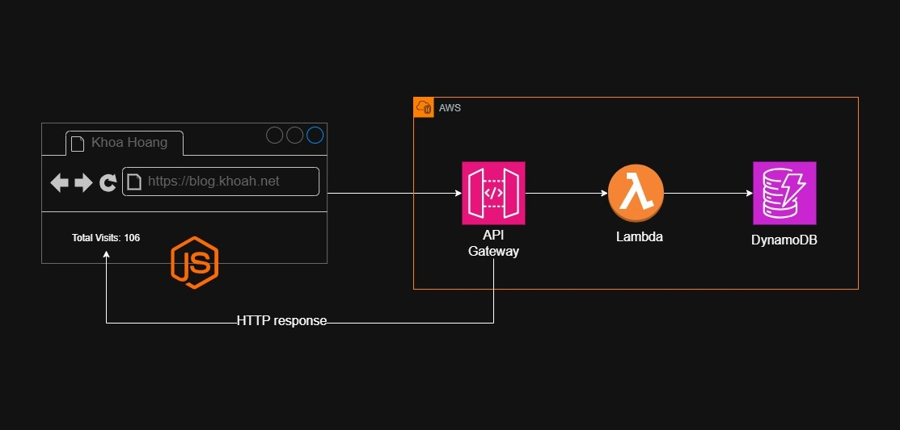

##

Count the vistor of my blog website. Using DynamoDB to store the data and Lambda to trigger the count and put the data to the database.
Goal:
- Using Terraform to spin up DynamoDB, Lambda, and API Gateway.
- Levarage Lambda to write data to database, API Gateway to trigger Lambda function.

